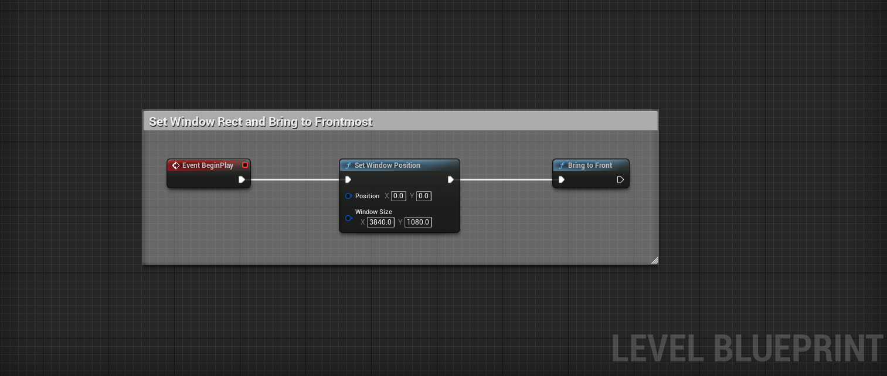

# Native Window Control

Minimal Unreal Engine 5 Plug-in to control application windows.

- Set Window Position: Force to set window position and size.
- Bring to Front : Bring to application window to frontmost on desktop.

## Supported Platforms

- Windows 10
- Windows 11

## TODO

- [x] Set window position and size.
- [x] Bring window to frontmost.
- [ ] Set window order.
- [ ] Set window style.

## License

The license is MIT Licence.

## Contributers

- [umetaman](https://github.com/umetaman/)